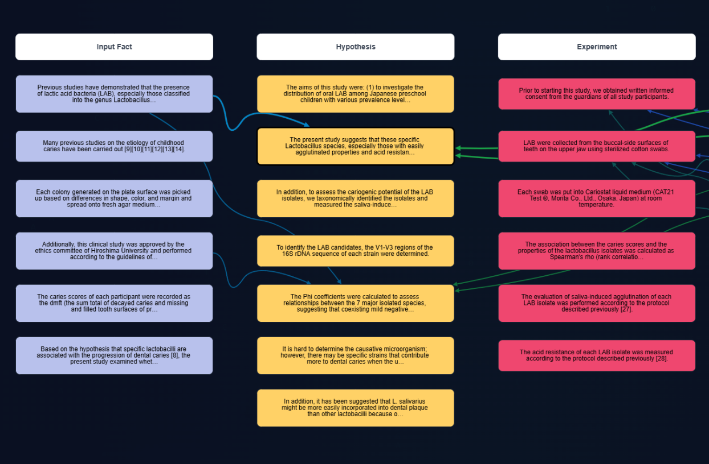
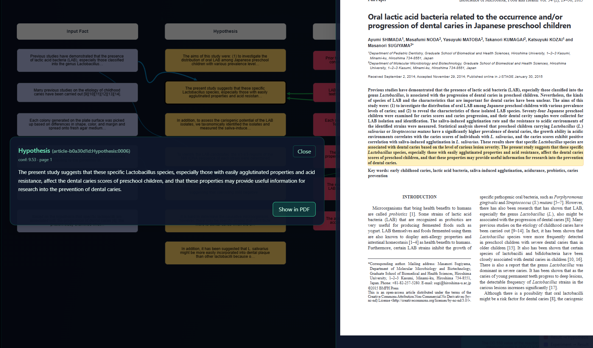

# Singularis 
## A deterministic knowledge-graph extractor for scientific PDFs

### Overview

Singularis turns scientific PDFs into graphs of atomic research elements—Input Fact, Hypothesis, Experiment, Technique, Result, Dataset, Analysis, Conclusion—linked with typed edges. The goal is to reach 80–90% of an LLM read-out’s quality at 10–100× lower cost and latency; LLMs are used sparingly (refine/QA/auto-rule suggestion), while the core extraction is deterministic and cheap.

### Architecture (services & code map)

* grobid — PDF→TEI for S0
* api — FastAPI gateway (queues, preview/graph endpoints)
* worker — executes the S0→S1→S2 pipeline and writes artifacts
* web — React + Cytoscape viewer
* redis — RQ queue + job status store. 

#### Repository highlights:

* `pipeline/pipeline/{s0_grobid.py, s1.py, s2.py, worker.py,…}` — stages & orchestration

* `ui/` — web client

* `rules/` — data-driven themes (spaCy matcher/dep-matcher + lexicon)

* `legacy_rules/` — historical YAML rule set (kept for reference). 

### Quick Start

    Spin up the full stack with Docker, run the pipeline on a PDF, and fetch the graph.

#### Prereqs

* Docker + Docker Compose
* A PDF to test with

1. Create a file `.env` based on the `.env.example` file (requires no changes)
2. Launch the stack:

        `docker compose up -d`

        # Services:
        # - GROBID on 8070/8071
        # - API on 8000
        # - Web UI on 3000 
        # - Redis on 6379

3. Open a web page: http://localhost:3000/

### Technologies (runtime & libs)

* **Python 3.11**, custom S1→S2 pipeline.
* **spaCy**: tokenization/lemmatization + `Matcher` and `DependencyMatcher` for rule-based patterns.
* Custom JSON pattern sets: `matcher.json` / `depmatcher.json` (common/… themes).
* Lightweight heuristics for IMRAD, polarity, and numeric cues (no embeddings).
* S2 is plain Python: normalization/dedup, edge type validation & “retyping,” fallback connectivity, and layout for the frontend.

#### Algorithm S1 (node extraction & initial edges)

1. **Input:** flattened sentences from S0 with metadata (page, bbox, section/IMRAD).
2. **Node type scoring:**

   * Run token/dep patterns; count hits for the 8 canonical types.
   * Multipliers: **IMRAD prior**, base type weights, thematic boosts, hedge penalty; numeric-feature bonus.
   * Tie-breaks and special nudges (e.g., in RESULTS/DISCUSSION, `Input Fact → Result` when dep-hits fire).
3. **Polarity:** light heuristic over lemmas/negation scope and stable phrases (e.g., “not significant”).
4. **Node formation:** assign `id`, `type`, `text`, `conf`, `polarity`, `prov` (section/imrad/sent_idx/page/bbox).
5. **Initial edges (structural, no text-to-text semantic matching):**

   * Sliding window **forward in text** + thresholds on sentence distance and **page distance**; IMRAD direction checks.
   * Edge types: `Technique→Experiment/Result: uses`, `Experiment→Result: produces`,
     `Result→Hypothesis: supports/refutes (from Result polarity)`,
     `Dataset→Experiment/Analysis: feeds`, `Analysis→Result: informs`,
     plus sanctioned `Result→Result: follows` and `Dataset→Result: summarizes`.
   * Edge confidence: average of the two node confidences + “hysteresis” threshold vs. distance; tiny bonuses for “same section / neighboring IMRAD”.
   * Plus linking via matched **Fig./Table** references (caption → “body”).  *(as summarized in your current setup)*

#### Algorithm S2 (normalization, dedup, relinking, layout)

1. **Load & prep:** take `s1_graph.json` (and optionally S0 context for LLM payload). Eight canonical node types with fixed column order.
2. **Node normalization/dedup:**

   * Map synonyms to canonical types.
   * Deduplicate by `(type, normalized_text, special context for Hypothesis)`, merging provenance and reconciling polarity.
3. **Edge relinking/validation:**

   * Check each edge’s **type-pair admissibility**; if the relation is non-canonical but the pair is allowed, S2 **retypes** it to the canonical one (marking `retyped`); if the pair is disallowed — drop it.
   * For `Result→Hypothesis`, relation is chosen from polarity (`supports/refutes`).
   * Dedup edges `(from,to,type)` by max `conf`; if none remain — add a **fallback backbone** (minimal connectivity: Result→Hypothesis, Technique/Dataset→Experiment, Analysis→Conclusion, …).
4. **Optional LLM refinement:** if connectivity is weak, assemble a compact payload (top nodes with sectional weights), call LLM to refine, then pass results through the same validations.
5. **Frontend layout:** assign columns/rows and **textual ordering** within columns: `(page, sent_idx, y, id)` so the order matches S1. The result is written to `graph.json`.
